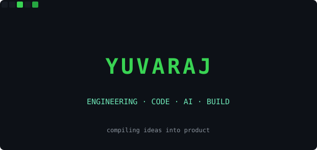

<div align="center">





```text
root@yuvaraj:~$ whoami
engineering_student
root@yuvaraj:~$ status
compiling ideas into production-ready projects
root@yuvaraj:~$ uptime
always learning · always building · always shipping_
```

`PORTFOLIO` &nbsp;&nbsp; `LINKEDIN` &nbsp;&nbsp; [**GITHUB**](https://github.com/Yuvaraj187) &nbsp;&nbsp; [**MAIL**](mailto:yuvarajvj18@gmail.com)

</div>

<br>

```text
[ 01 ]  about
```

<table>
<tr><td width="42">🎓</td><td width="110"><code>education</code></td><td>engineering student · information technology</td></tr>
<tr><td>📍</td><td><code>location</code></td><td>India</td></tr>
<tr><td>💻</td><td><code>focus</code></td><td>full stack development · Java · DSA · AI / ML</td></tr>
<tr><td>🧪</td><td><code>role</code></td><td>student · developer · fresher</td></tr>
<tr><td>🚀</td><td><code>building</code></td><td>CivicPulse and practical industry-ready projects</td></tr>
</table>

> *first, solve the problem. then, write the code.*

<br>

```text
[ 02 ]  currently
```

<div align="center">

`BUILDING` **CIVICPULSE** &nbsp;&nbsp; `LEARNING` **JAVA + DSA** &nbsp;&nbsp; `LEARNING` **FULL STACK**

`EXPLORING` **AI / ML** &nbsp;&nbsp; `PRACTICING` **SELENIUM + TESTING**

</div>

<br>

```text
[ 03 ]  stack
```

<div align="center">

`JAVA` `PYTHON` `JAVASCRIPT` `HTML` `CSS` `REACT` `NODE.JS` `EXPRESS`

`POSTGRESQL` `MONGODB` `SQL` `PRISMA` `SELENIUM` `GIT` `GITHUB` `VS CODE`

</div>

<br>

```text
[ 04 ]  activity
```

<div align="center">


</div>

<br>

```text
[ 05 ]  projects
```

<table>
<tr>
<td width="33%" valign="top">

### 🚦 CivicPulse

AI-assisted civic grievance platform for reporting, routing, tracking and resolving public infrastructure issues.

`React` `Node.js` `PostgreSQL` `Prisma`

</td>
<td width="33%" valign="top">

### 🤖 AI Projects

Practical AI/ML projects focused on prediction, automation, assistants and real-world problem solving.

`Python` `AI/ML` `APIs`

</td>
<td width="33%" valign="top">

### 🧪 Automation Lab

Browser automation and testing projects built while learning Selenium with Python.

`Python` `Selenium` `Testing`

</td>
</tr>
</table>

<br>

```text
[ 06 ]  experience
```

<table>
<tr><td width="42">🎓</td><td width="110"><code>2026 →</code></td><td><b>engineering student</b><br><sub>building projects for software engineering placements · Java / DSA / full stack / AI</sub></td></tr>
<tr><td>💻</td><td><code>now</code></td><td><b>project builder</b><br><sub>turning academic ideas into practical applications and automation workflows</sub></td></tr>
</table>

<br>

```text
[ 07 ]  highlights
```

<div align="center">

`JAVA + DSA` &nbsp; `FULL STACK` &nbsp; `AI / ML` &nbsp; `SELENIUM` &nbsp; `POSTGRESQL`

</div>

<table>
<tr><td width="42">▸</td><td>industry-oriented <b>CivicPulse</b> project with civic issue tracking and department routing</td></tr>
<tr><td>▸</td><td>learning <b>Java + DSA</b> with a placement-focused problem-solving approach</td></tr>
<tr><td>▸</td><td>building practical projects across <b>AI, full stack development and automation</b></td></tr>
</table>

<br>

```text
[ 08 ]  contributions
```

<div align="center">


</div>

<br>

<div align="center">

```text
$ git status
learning    → Java / DSA / System Design
building    → CivicPulse / AI / Full Stack
improving   → problem solving / software engineering
status      → ████████████████████ 100% curious
```

<sub>exit code 0 · thanks for stopping by · living profile updated automatically</sub>

</div>
