<div align="center">


<br>


<br><br>

<a href="https://github.com/Yuvaraj187"></a>
<a href="https://linkedin.com/in/yuva-raj-v"></a>
<a href="mailto:yuvarajvj18@gmail.com"></a>
<a href="https://github.com/Yuvaraj187"></a>

<br><br>


</div>

---

```text
[ 01 ]  about
```

I am an engineering student focused on **software engineering, full-stack development, AI/ML, automation, and problem solving**. I enjoy turning real-world requirements into practical software systems and continuously strengthening the engineering fundamentals behind them.

My current development path combines **Java + DSA for problem solving**, **React + Node.js + SQL for product development**, and **Python + AI/ML + Selenium for intelligent automation and experimentation**.

**Product mindset:** understand the problem → design the system → build the smallest useful solution → test it → improve it.

**Open To:** software engineering internships · fresher opportunities · collaborative projects · AI-enabled products · open-source learning

---

```text
[ 02 ]  tech stack
```

### Languages
<div align="center"></div>

### Frontend
<div align="center"></div>

### Backend & Databases
<div align="center"></div>

### Cloud, DevOps & Tooling
<div align="center"></div>

---

```text
[ 03 ]  ai / ml expertise
```

| Domain | Proficiency | Details |
|---|---|---|
| Generative AI | Developing | LLM concepts, AI assistants, API-driven applications |
| AI Agents | Developing | Agent workflows and practical automation concepts |
| Predictive AI | Developing | Prediction-oriented project exploration |
| Multimodal AI | Exploring | Image, speech and video intelligence concepts |
| AI + Full Stack | Developing | Integrating AI capabilities into practical web applications |
| AI Automation | Developing | Python-based automation and intelligent workflows |

---

```text
[ 04 ]  featured projects
```

<details><summary><strong>🚦 CivicPulse — AI-Assisted Civic Grievance Platform</strong></summary>

CivicPulse is an industry-oriented civic issue reporting and grievance management platform designed to make public infrastructure complaints easier to report, route, track and resolve.

| Attribute | Details |
|---|---|
| **Stack** | React · Node.js · PostgreSQL · Prisma |
| **Scale** | Multi-category civic issue workflow |
| **Performance** | Structured API and database-backed issue tracking |
| **Security** | Authentication, role-aware workflows and controlled issue access |
| **Impact** | Improves transparency and visibility of civic grievance resolution |
| **Repository** | [GitHub](https://github.com/Yuvaraj187) |

**Engineering scope**
- Issue reporting and categorization
- Department routing
- Status lifecycle and resolution tracking
- Duplicate, rejected, on-hold and reopened workflows
- PostgreSQL data modeling with Prisma
- REST API-oriented backend architecture

</details>

<details><summary><strong>🤖 AI / ML Project Portfolio</strong></summary>

A growing collection of practical AI/ML project work focused on prediction, intelligent automation, assistants and real-world problem solving.

| Attribute | Details |
|---|---|
| **Stack** | Python · AI/ML · APIs |
| **Scale** | Academic and placement-oriented prototypes |
| **Performance** | Iterative experimentation and evaluation |
| **Security** | API-aware development and responsible data handling |
| **Impact** | Converts AI concepts into demonstrable software applications |
| **Repository** | [Repositories](https://github.com/Yuvaraj187?tab=repositories) |

</details>

<details><summary><strong>🧪 Selenium Automation Lab</strong></summary>

Hands-on browser automation and software testing work using Python and Selenium, focused on reliable automation logic and test workflows.

| Attribute | Details |
|---|---|
| **Stack** | Python · Selenium |
| **Scale** | Learning and automation exercises |
| **Performance** | Locator-driven and reusable automation patterns |
| **Security** | Test-environment oriented workflows |
| **Impact** | Practical foundation in automated web testing |
| **Repository** | [Repositories](https://github.com/Yuvaraj187?tab=repositories) |

</details>

---

```text
[ 05 ]  experience
```

| Role | Date Range | Professional Scope |
|---|---|---|
| **Engineering Student / Project Developer** | Current | Building placement-oriented software projects across Java, DSA, full stack development, AI/ML and automation. |
| **Software Engineering Learner** | Ongoing | Developing practical skills through structured projects, debugging, API development, database work and testing. |

**Scope of work**
- Build and debug full-stack applications
- Design REST-oriented backend workflows
- Work with PostgreSQL, MongoDB and SQL concepts
- Practice Java and DSA for software engineering interviews
- Develop Python automation using Selenium
- Explore AI/ML and AI-enabled application development

`JAVA` `DSA` `REACT` `NODE.JS` `POSTGRESQL` `PYTHON` `SELENIUM` `AI/ML`

---

```text
[ 06 ]  achievements
```

<div align="center">

| Recognition | Details |
|---|---|
| **Project Development** | Building CivicPulse as an industry-oriented civic technology project |
| **Technical Growth** | Structured learning across Java, DSA, full stack, AI/ML and automation |
| **Engineering Practice** | Hands-on work with APIs, databases, testing and software project architecture |

</div>

---

```text
[ 07 ]  certifications
```

<div align="center">

[](https://aws.amazon.com/)
[](https://www.oracle.com/)
[](https://nptel.ac.in/)
[](https://www.cisco.com/)

</div>

---

```text
[ 08 ]  coding profiles
```

<div align="center">
<a href="https://leetcode.com/"></a>
<a href="https://www.geeksforgeeks.org/"></a>
<a href="https://www.hackerrank.com/"></a>
<a href="https://www.codechef.com/"></a>
</div>

---

```text
[ 09 ]  github analytics
```

<div align="center">


<br>

</div>

---

```text
[ 10 ]  github trophies
```

<div align="center"></div>

---

```text
[ 11 ]  contribution activity
```

<div align="center"></div>

---

```text
[ 12 ]  contribution snake
```

<div align="center"></div>

---

```text
[ 13 ]  current focus
```

```yaml
profile:
  role: Engineering Student / Aspiring Software Engineer
  location: India
learning:
  - Java
  - Data Structures & Algorithms
  - Full Stack Development
  - System Design fundamentals
building:
  - CivicPulse
  - AI-enabled applications
  - Automation and testing projects
exploring:
  - Generative AI
  - AI Agents
  - Predictive AI
  - Multimodal AI
open_to:
  - Software Engineering Internships
  - Fresher Software Roles
  - Collaborative Projects
  - Open Source Learning
```

---

```text
[ 14 ]  connect
```

<div align="center">
<a href="mailto:yuvarajvj18@gmail.com"></a>
<a href="https://linkedin.com/in/yuva-raj-v"></a>
<a href="https://github.com/Yuvaraj187"></a>
<a href="https://github.com/Yuvaraj187"></a>
</div>

---

<div align="center">

> **Build with intent. Learn continuously. Ship reliably.**


</div>
